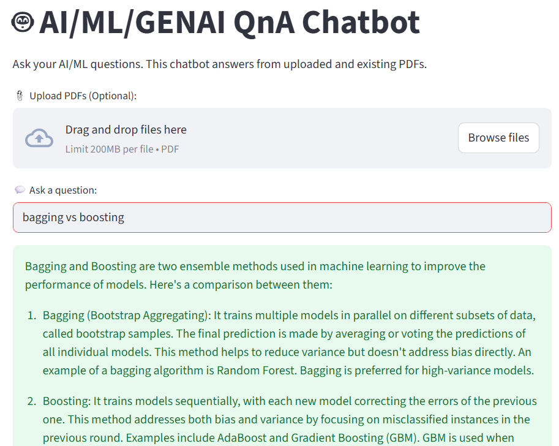
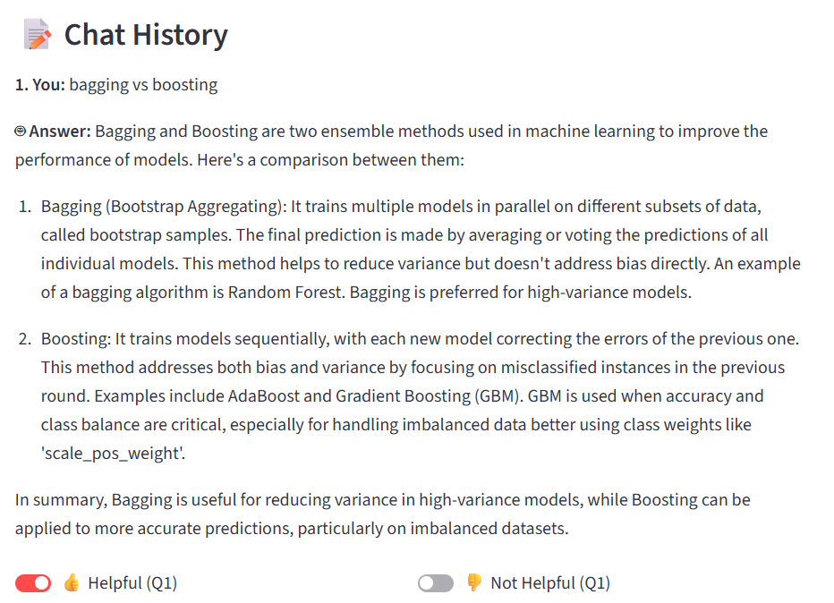

# AI_Agent
1.Create Chatbot using Langchain and 
-vector db: FAISS DB
-model used: Mistral from ollama
It answers the AI/ML/GENAI interview questions

# New update
Feedback system using thumbs up/down toggle for each response.

Automatically saves PDFs and loads existing ones.

Chat history retained across interactions.

Source document chunk preview after each response.

